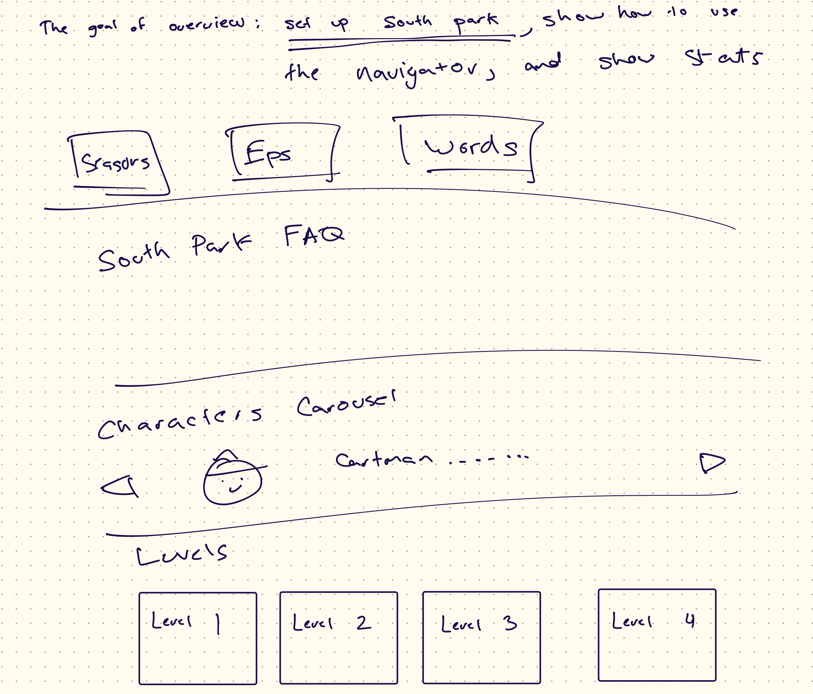
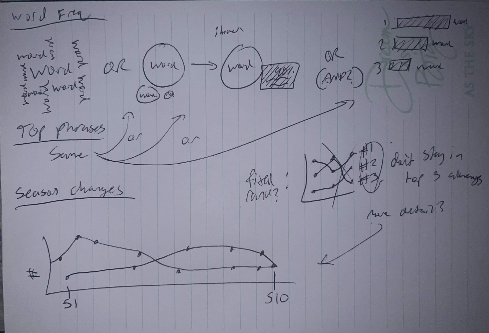
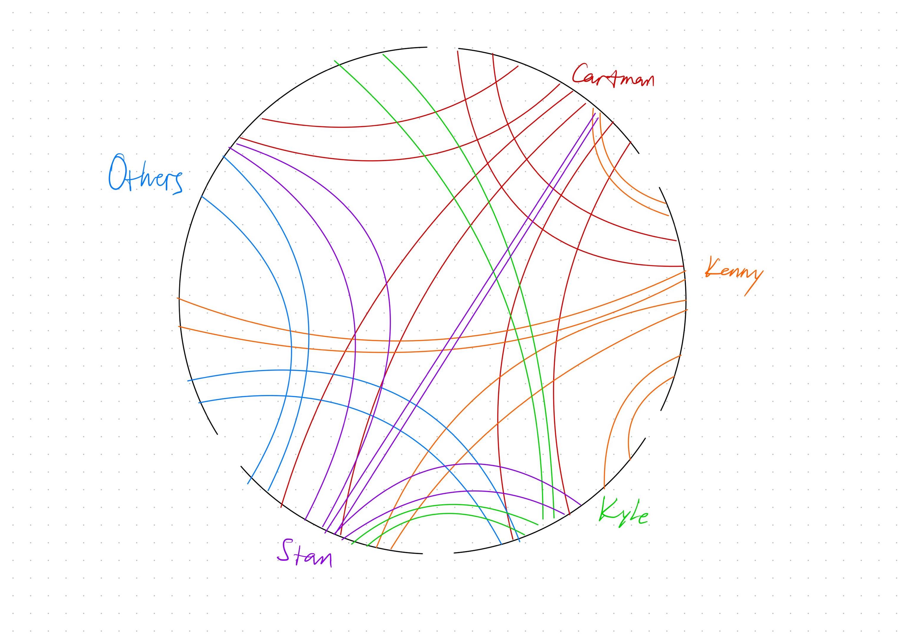
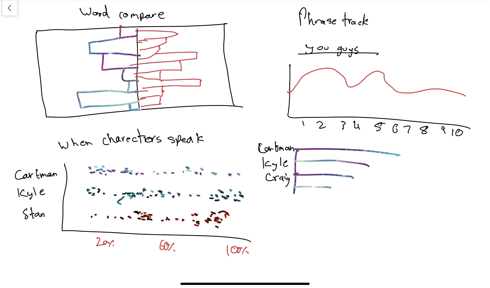
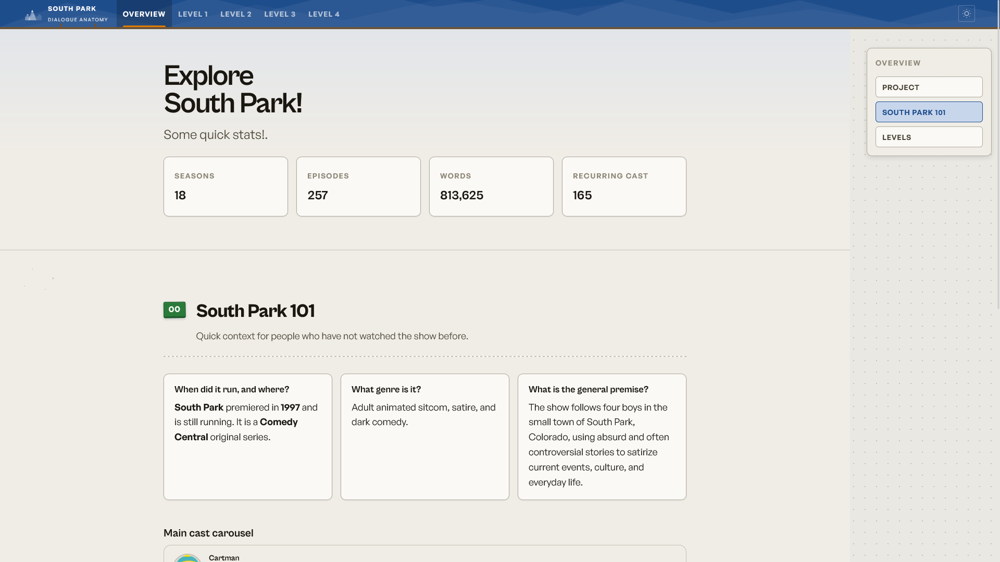
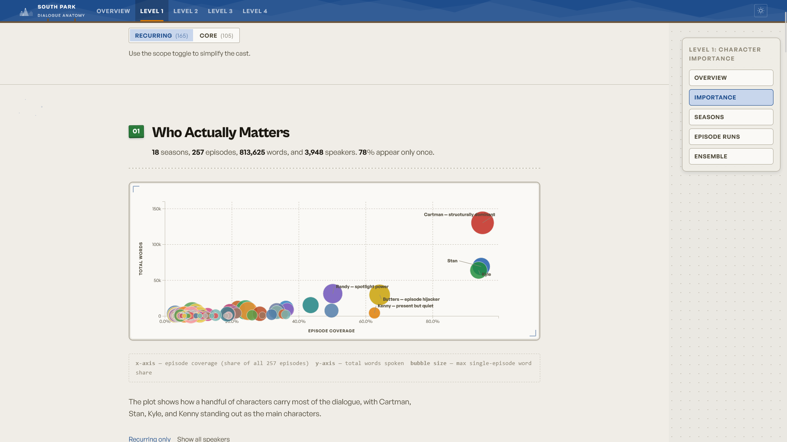
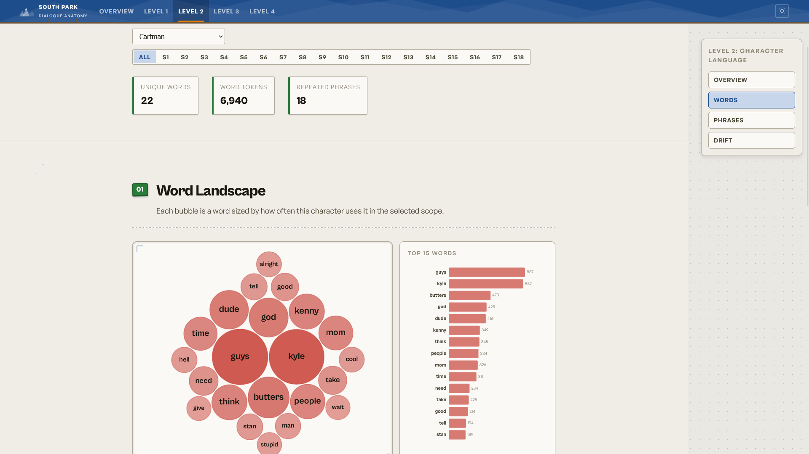
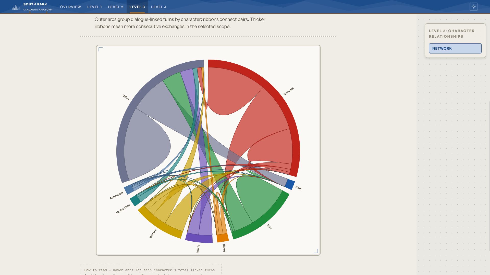
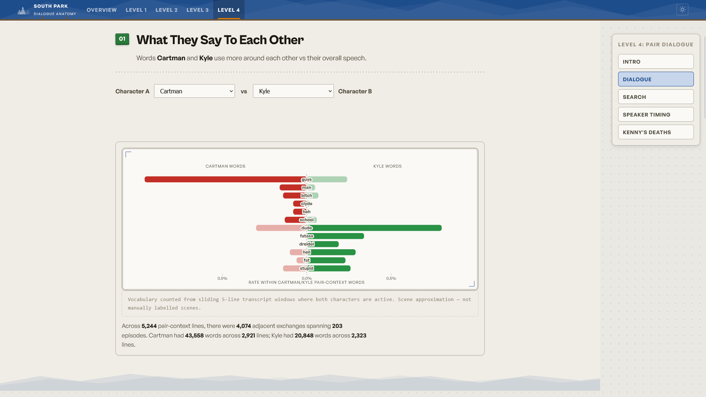

# South Park — Dialogue Anatomy

**Project 3: TV Time** is an interactive exploration of South Park dialogue: who speaks, how much, what they say, who they talk next to, and how that changes across seasons.

---

## Live links

| Resource | Link |
|----------|------|
| This documentation (GitHub Pages) | *Link Here* |
| Live application | *Vercel deployment URL* |
| Source code | [github.com/SheteUC/vis2-southpark](https://github.com/SheteUC/vis2-southpark) |
| Demo video | *YouTube or hosted file* |

---

## Motivation

Transcripts encode structure: cast hierarchy, episode-level dominance, vocabulary, and co-speech patterns. We use South Park because it has many episodes, a strong recurring ensemble, and dialogue that evolves over a long run. So we can combine **importance**, **language**, **networks**, and **show-specific** extensions in one tool.

**Questions the app supports**

- Who matters overall vs in a given season or episode?
- What words and phrases characterize a speaker?
- Who tends to speak in adjacent turns (a proxy for “in scene together”)?
- How do language and relationships change over time?
- What extra patterns (e.g. pair speech, phrase trends, timing) appear at Level 4?

---

## Show overview

| | |
|--|--|
| **Show** | South Park |
| **Genre** | Adult animated sitcom, satire, dark comedy |
| **Network** | Comedy Central |
| **Premiere** | 1997 (ongoing) |
| **Data in this project** | Seasons 1–18, 257 episodes |

The core ensemble (Cartman, Stan, Kyle, Kenny) plus rising figures like Butters and Randy gives both **stable anchors** and **spotlight** characters, useful for longitudinal analysis.

---

## Data

| | |
|--|--|
| **Source** | [yaylinda/south-park-dialog](https://github.com/yaylinda/south-park-dialog) |
| **Fields used** | `Season`, `Episode`, `Character`, `Line` |
| **Raw rows** | 142,442 |
| **After cleaning** | 70,876 lines, 813,625 words, 3,948 unique speakers |

Speaker labels and episode IDs are required for this assignment; preprocessing is treated as a first-class part of the project, not a one-off cleanup.

---

## Data processing

Scripts live in the **repository root** (same repo as the app).

| Script | Purpose |
|--------|---------|
| `preprocess.py` | Core JSON bundle: overview, Level 1, `network.json`, initial `pair-dialogue.json`, etc. |
| `preprocess_timing.py` | `episode-timing.json` (Level 4 speaking position in episode) |
| `preprocess_pairs.py` | Richer `pair-dialogue.json` for multiple character pairs |

**Cleaning (conservative)**  
Trim names, drop empty / single-char / numeric-only labels, keep canonical spellings from the dataset, avoid fuzzy merges so results stay reproducible.

**Speaker tiers (UI scopes)**

| Tier | Rule | Count (approx.) |
|------|------|-----------------|
| Guest / one-off | 1 episode | 3,096 |
| Recurring | ≥ 8 episodes | 165 |
| Core | ≥ 12 episodes | 105 |

**Models**

- **Interactions (Level 3):** edges from **consecutive lines** between recurring speakers, not manual scene tags. Consistent across the corpus; limitations should be stated in write-ups or presentation.
- **Pair context (Level 4):** vocabulary from **sliding windows** where both selected characters have lines, shared conversational context, not “all lines ever.”

---

## Visualization design

Routing: **one route per assignment level** (Overview, Level 1–4), with in-page section nav.

### Overview

Landing context: show basics, dataset scale, entry into each level.

### Level 1 — Character importance

| View | Role |
|------|------|
| Scatter | Coverage × total words; bubble size ≈ max single-episode word share |
| Hierarchy bars | Rank by words, episodes, or words/episode |
| Seasonal lines | Share or rank over seasons |
| Episode heatmap | Per-episode presence and word intensity for a chosen character |
| Rank divergence | Presence rank vs volume rank |
| Episode “ownership” | Distribution of who dominates each episode |
| Ensemble | Clusters (anchors, spotlight, support, etc.) |

**Rationale:** start with a global picture, then seasonality and episode detail, then richer notions of “importance” than a single number.

### Level 2 — Language (Option 1)

Character + **all seasons or one season**: word frequency encoding (pack layout), top-word bars, repeated phrases, seasonal drift for top terms.

**Why Option 1 first:** distinctive voices and catchphrases are central to South Park; language views stand alone before adding the network.

### Level 3 — Network (Option 2)

**Chord diagram** of adjacent-turn interactions; filter **all seasons** or **one season**. Minor roles aggregated where needed for readability.

**Rationale:** chord emphasizes pairwise strength; season filter satisfies “change over the run.”

### Level 4 — Extensions

| Piece | Idea |
|-------|------|
| Pair vocabulary | Diverging bars: words skewed toward A vs B in shared context |
| Phrase search | Seasonal frequency, first/last activity, top speakers |
| Speaker timing | Median line position within episode (early vs late) |
| Kenny deaths | Seasonal bar chart from curated `kenny-deaths.json` |

---

## Interaction design

- Level and section navigation  
- Recurring / core (and long-tail where applicable)  
- Character and season selectors  
- Phrase search and suggested terms  
- Tooltips and hover emphasis on charts  

Goal: progressive disclosure instead of one overloaded dashboard.

---

## Design sketches

Early layout and interaction notes for each major level (committed under `docs/assets/sketches/`).

### Level 1 — Character importance



### Level 2 — Language



### Level 3 — Network



### Level 4 — Extensions



---

## Findings (examples from the current analysis)

1. **Cartman is the clearest structural center of the dataset.** In Level 1 he combines the highest total word count (**130,037 words**), near-total episode coverage (**244 / 257 episodes**), and the most “top speaker” episodes (**102**). His maximum single-episode share also reaches **55.7%**, so he is not just consistently present; he often dominates individual episodes outright.  
2. **Stan and Kyle function as stable anchors rather than spike-driven leads.** Both appear in more than **93%** of episodes, but their peak episode shares are much lower than Cartman’s (**31.1%** for Stan, **28.9%** for Kyle). The scatter, seasonal lines, and episode views together suggest they provide continuity across the run while Cartman more often becomes the focal voice.  
3. **Randy and Butters stand out as “spotlight” characters.** They do not match the main boys in overall coverage, but when an episode centers them they surge dramatically: Randy is the top speaker in **19** episodes, and Butters reaches a **45.4%** max episode word share. This makes them especially visible in the episode-level and rank-divergence views, where they behave differently from steadier ensemble characters.  
4. **Kenny shows the sharpest presence-versus-volume split, and the Level 4 extension reinforces that reading.** He appears frequently enough to remain part of the core cast structure, but his word totals stay comparatively low in Level 1. At the same time, the Kenny deaths view shows that the joke is heavily concentrated in the early run, with high counts in Seasons **1–5** and a steep drop afterward, reflecting how one character can remain iconic even when the dialogue signal is relatively small.  
5. **Relationships and language are strongly context-dependent, which is why the app needs both Levels 2–4.** In Level 3, pair strengths shift by season instead of staying fixed across the whole series. In Level 4, the default Cartman–Kyle pair alone spans **203 episodes** and **4,074** adjacent exchanges, but their distinctive vocabularies diverge sharply: Cartman over-indexes on words like **“guys”** and **“bitch,”** while Kyle leans toward **“dude”** and **“fatass.”** That contrast shows why character analysis works better when we look at shared conversational context, not just global word counts.

---

## Screenshots

Captured from the live application (`docs/assets/screenshots/`).

### Overview



### Level 1 — Character importance



### Level 2 — Language



### Level 3 — Character relationships (network)



### Level 4 — Pair dialogue and extensions



---

## Implementation

**Stack:** D3 v7, d3-cloud, Vite; plain HTML/CSS/JS (no SPA framework). **Preprocessing:** Python (`pandas`, `numpy`).

| Path | Contents |
|------|----------|
| `src/app/` | App shell, routes, data loader, theme |
| `src/levels/` | Overview + Level 1–4 views |
| `src/shared/` | Shared chart helpers |
| `public/data/` | Generated JSON consumed by the client |
| `public/images/` | Static images |

**Local run**

```bash
npm install
python preprocess.py
python preprocess_timing.py
python preprocess_pairs.py
npm run dev
```

**Production build**

```bash
npm run build
npm run preview
```

Requires **Node 18+** and **Python 3** with `pandas` and `numpy`.

---

## Demo video

> **To add:** link to YouTube, Google Drive, or your portfolio page.


---

## Team contributions

- **Atharv** —> Level 1  
- **Logan** —> Level 2  
- **Ziad** —> Level 3  
- **Kaus** —> Overview and Level 4  
- **Shawn** —> Level 4  

---

## Repository

[https://github.com/SheteUC/vis2-southpark](https://github.com/SheteUC/vis2-southpark)
